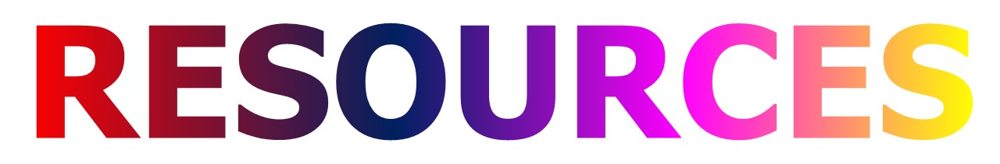

<b>Some important links for guide</b>

## Content
|Competitive Programming|Professional Competence|Interview|Algorithm|
|-|-|-|-|
|[HackerEarth](https://www.hackerearth.com/)|[SPOJ](https://www.spoj.com/)||[Practice:Geeksforgeeks](https://practice.geeksforgeeks.org/)|
|[HackerRank](https://www.hackerrank.com)|[Leet Code](https://leetcode.com)|[Careercup](https://www.careercup.com/)|[Codes Dope](https://www.codesdope.com/)|
|[CodeWars](https://www.codewars.com/)|[Top Coder](https://www.topcoder.com/)|[Mock Questions](https://www.mockquestions.com/)|[DS&Algo](https://discuss.codechef.com/t/data-structures-and-algorithms/6599)|
|[Codechef](https://www.codechef.com/)|[Code jam](https://codingcompetitions.withgoogle.com/codejam)|[Tech Interview Pro](https://www.techseries.dev/) |[AlgoExpert](https://www.algoexpert.io/product)|
|[Code Forces](codeforces.com)|[Hash Code](https://codingcompetitions.withgoogle.com/hashcode/schedule)| [DAILY Interview Pro](https://www.techseries.dev/daily)|[Algorithm_Implementation](https://en.wikibooks.org/wiki/Algorithm_Implementation)|
|[Coderbyte](https://coderbyte.com/) | |[Interview Bit](https://www.interviewbit.com/)|[Programming Tasks](http://rosettacode.org/wiki/Category:Programming_Tasks)|

>Code Jam is Google's longest running global coding competition, where programmers of all levels put their skills to the test.

---

## Web Friendly Tools 
|Content|Info|
|-|-|
|**[zerotomastery](https://zerotomastery.io/blog/)**|Professional Web And Technology related Blogs|
|**[Freebies.ByPeople](https://freebies.bypeople.com/)**|All the freebies in one location fonts,icons,vectors,plugin,themes,modals,snippets etc.|
|**[AbsurdDesign](https://absurd.design/chapter1.html)**|free absurd illustrations|
|**[DOCUMENT-GENERATOR](https://qwilr.com/document-generator/)**|Automatically generate personalized proposals, case studies, invoices, and brochures for your growing business in minutes. Free to send and download.|
|**[HumansFYI](https://humans.fyi/)**|Inspirations for your portfolio website|
|**[>GENERATED PHOTOS](https://generated.photos/)**|100,000 Faces Generated by AI Free to Download|
|**[Project Naptha](https://projectnaptha.com/)**|highlight, copy, and translate text from any image|
|**[GLAZE](https://www.glazestock.com/)**|Free illustrations, for everything|
|**[Fresh-Folk](https://fresh-folk.com/)**|an illustration library of people and objects|
|**[OpenDoodles](https://www.opendoodles.com/)**|A Free Set of Sketchy Illustrations - no need to credit|
|**[icon8](https://icons8.com/)**|Free Design Resources and Software - photos, vectors, music, Lunacy, DesignBlogs, UISounds, IconApps etc.|
|**[Lunacy](https://icons8.com/lunacy)**|Free Graphic Design Software|
|**[Font Awesome](https://fontawesome.com/)**|Get vector icons and social logos on your website.|
|**[Tools for Web Developers ](https://developers.google.com/web/tools/chrome-devtools/)**|DevTools can help you edit pages on-the-fly and diagnose problems quickly, which ultimately helps you build better websites, faster.|
|**[UnSplash](https://unsplash.com/)**|The internet’s source of freely usable images.Powered by creators everywhere.|
|**[Paletton](https://paletton.com)**|A designer tool for creating color combinations that work together well. Formerly known as Color Scheme Designer.|
|**[Coolors](https://coolors.co/)**|The super fast color schemes generator!|
|**[Google Fonts](https://fonts.google.com/)**|Making the web more beautiful, fast, and open through great typography.|

## WEB TOOLS & HELP

#### [How Google Search works](https://www.google.com/search/howsearchworks/)
>Every time you search, there are thousands, sometimes millions, of webpages with helpful information. How Google figures out which results to show starts long before you even type, and is guided by a commitment to you to provide the best information.

|**YouTube Channels**|
|-|
|LearnCode.academy|
|LevelUpTuts|
|Kevin Powell|
|Red Stapler|
|Traversy Media|

##### Stack Overflow
* [Stack Overflow](https://stackoverflow.com/)
>Stack Overflow is a question and answer site for professional and enthusiast programmers. It is a privately held website, the flagship site of the Stack Exchange Network, created in 2008 by Jeff Atwood and Joel Spolsky. It features questions and answers on a wide range of topics in computer programming.

##### Netlify
* [Netlify](https://www.netlify.com/)
> One workflow. From local development to global deployment.Netlify is everything you need to build fast, modern websites: continuous deployment, serverless functions, and so much more. 

**[Tutorialrepublic](https://www.tutorialrepublic.com/)**
> At tutorialrepublic.com you can learn the essentials of web development technologies from the basic to advanced topics, along with real life practice examples and useful references, so that you can create your own website or build career in web development. Here you will find:

##### W3 Schools
* [W3Schools](https://www.w3schools.com/)
>educational website for learning web technologies online.

##### Learn to Code HTML & CSS
* [Learn to Code HTML & CSS](https://learn.shayhowe.com/)
>Learn to Code HTML & CSS has one goal — to teach people how to build beautiful and intuitive websites by way of clear and organized lessons. The guide covers a variety of web design and development topics, ranging from beginner to advanced skill levels.

##### Markup Validation Service
* [W3C Validation](https://validator.w3.org/)
>Check the markup (HTML, XHTML, …) of Web documents

##### WAVE Web Accessibility Tool
* [WAVE](https://github.com/30-seconds/30-seconds-of-react)
>WAVE has been used to evaluate the accessibility of millions of web pages.

##### Can I use
* [Can I use](https://caniuse.com/)
>Browser support tables for modern web technologies: "Can I use" provides up-to-date browser support tables for support of front-end web technologies on desktop and mobile web browsers.

##### CSS grid Styling
* [css grid](https://www.mozilla.org/en-US/developer/css-grid/)
>CSS Grid simplifies existing layout patterns and adds new possibilities for graphic design.

##### A Complete Guide to Flexbox
* [Css Tricks Flexbox](https://css-tricks.com/snippets/css/a-guide-to-flexbox/)
>Our comprehensive guide to CSS flexbox layout. This complete guide explains everything about flexbox, focusing on all the different possible properties for the parent element (the flex container) and the child elements (the flex items). It also includes history, demos, patterns, and a browser support chart.

##### Digital Garage Courses
* [Online courses](https://learndigital.withgoogle.com/digitalgarage/courses/data_tech)
>Discover a range of free learning content designed to help grow your business or jump-start your career. You can learn by selecting individual modules, or dive right in and take an entire course end-to-end.

---

## Books and Files
##### Library Genesis
* [Library Genesis](https://libgen.is/)
* [Library Genesis](http://gen.lib.rus.ec/)
>Library Genesis or LibGen is a search engine for articles and books on various topics

**[PDFdrive](https://www.pdfdrive.com/)**
>PDF Drive is your search engine for PDF files.

**[Academia.edu](https://www.academia.edu/)**
>Academia is the easiest way to share papers with millions of people across the world for free.

---

## Moz://a

##### FIREFOX DEVTOOLS PLAYGROUND
* [Mozilla DevTools](https://mozilladevelopers.github.io/playground/?utm_source=www.mozilla.org&utm_medium=referral&utm_campaign=nav&utm_content=developers)
>Learn, build, improve, and create with Firefox DevTools.

##### MDN Web Docs
* [MDN Web Docs](https://developer.mozilla.org/en-US/)
>MDN Web Docs, previously Mozilla Developer Network and formerly Mozilla Developer Center, is the official Mozilla website for development documentation of web standards and Mozilla projects.

##### Mozilla Hacks
* [Mozilla Hacks](https://hacks.mozilla.org/)
>Learn the best of web development today, and discover what's ahead for the web of tomorrow with Mozilla. 

##### Mozilla css grid Styling
* [css grid](https://www.mozilla.org/en-US/developer/css-grid/)
>CSS Grid simplifies existing layout patterns and adds new possibilities for graphic design.

---

|Platform| The information regarding it.|
|-|-|
|**[TechCrunch](https://techcrunch.com/)**|TechCrunch is an American online publisher focusing on the tech industry. The company specifically reports on the business related to tech, technology news, analysis of emerging trends in tech, and profiling of new tech businesses and products. It was one of the earliest publications to report extensively on tech startups and funding.|
|**[HackerNoon](https://hackernoon.com/)**|Independent Tech Media Site - Technologists, Software Developers, Bitcoiners, Blockchain Enthusiasts|
|**[Tech MeMe](https://www.techmeme.com/)**|Techmeme is a technology news aggregator. The website has been described as "a one-page, aggregated, filtered, archiveable summary in near real-time of what is new and generating conversation|
|**[Inc](https://www.inc.com/)**|Latest issue of Inc. Magazine and get advice, tools, and services that help your small business grow.|
|**[Medium](https://medium.com/)**|Medium is an online publishing platform: Medium taps into the brains of the world’s most insightful writers, thinkers, and storytellers to bring you the smartest takes on topics that matter. So whatever your interest, you can always find fresh thinking and unique perspectives.|

---

## UI/UX/DESIGN - 

**[Dribble](https://dribbble.com/)**
>THE HEART OF DESIGNER COMMUNITY: Dribbble is the single most important social network for anyone that cares about design. It’s done more to help us build our team and brand than Facebook, Twitter and Instagram combined.

**[Behance](https://www.behance.net/)**
>Behance (stylized as Bēhance) is an online platform owned by Adobe to showcase and discover creative work. Showcase & Discover
Creative Work.

**[Product Hunt](https://www.producthunt.com/)**
>Product Hunt surfaces the best new products, every day. It's a place for product-loving enthusiasts to share and geek out about the latest mobile apps, websites, hardware projects, and tech creations.

**[Awwwards](https://www.awwwards.com/)**
>Awwwards are the Website Awards that recognize and promote the talent and effort of the best developers, designers and web agencies in the world.

---

## Extras
##### The World Wide Web turns 30: our favorite memories from A to Z
* [WWW A to Z](https://www.theverge.com/2019/3/12/18259700/world-wide-wide-turns-30-www-anniversary-favorite-sites)

##### How to land a top-notch tech internship
* [Freecodecamp](https://www.freecodecamp.org/news/how-to-land-a-top-notch-tech-job-as-a-student-5c97fec82f3d/)

##### Problem Solving with Algorithms and Data Structures using Python
* [Problem Solving with Python](https://runestone.academy/runestone/books/published/pythonds/index.html)
>To review the ideas of computer science, programming, and problem-solving.

##### How to Think Like a Computer Scientist: Interactive Edition
* [Think Like a Computer Scientist](https://runestone.academy/runestone/books/published/thinkcspy/index.html)
>The goal of this book is to teach you to think like a computer scientist. This way of thinking combines some of the best features of mathematics, engineering, and natural science. Like mathematicians, computer scientists use formal languages to denote ideas (specifically computations)

##### TutorialsPoint
* [tutorialspoint](https://www.tutorialspoint.com/)
>The Biggest Online Tutorials Library, It's all Free.

##### Sub-Reddits
* [Technology](reddit.com/r/technology/)
>One of the flagship subs with 8mn+ subscribers — for all things tech.
* [Privacy](https://www.reddit.com/r/privacy/)
>One of the fundamental problems with the increasing pervasiveness of technology is how it affects our privacy.
* [Artificial](https://www.reddit.com/r/artificial/)
>For AI
