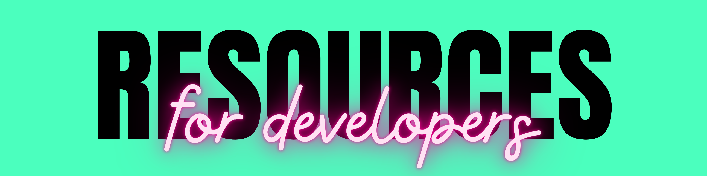

<!-- 
 Github : mrjatinchauhan
 Title  : Resources
-->

<!-- Now you have come here. Atleast make a contribution to this repo.-->
<!-- You Can Star & Share this repo if you liked it.😄 -->

**Feel free to open an issue (even better, send a Pull Request) to enhance this list. [Contributions](./CONTRIBUTING.md) are always welcome!**

## Images & Photos

Particulars|Info
-|-
**[Ancestry Images](http://www.ancestryimages.com/)**|Free stock images for genealogists and ancestry researchers offering scans of old and antiqueprints and maps for family history research.
**[Barnimages](https://barnimages.com/)**|Free high-resolution images for everyone.
**[CC Search](https://search.creativecommons.org/)**|Browse over 500 million images, available for reuse.
**[Clip Canvas](https://www.clipcanvas.com/home/)**|Welcome to The Art of Stock Footage.
**[Envato Elements](https://elements.envato.com/photos)**|2Mn+ royalty-free stock photos.
**[Flickr](https://www.flickr.com/)**|Home to tens of billions of photos.
**[Foodies Feed](https://www.foodiesfeed.com/)**|Trending free food photos.
**[Foter](https://foter.com/)**|Explore the most popular ideas and the best products, curated by interior design experts.
**[Free Digital Photos](http://www.freedigitalphotos.net/)**|Large resource is broken down into categories. All images free for educational, personal or commercial use.
**[Free Images](https://www.freeimages.com/)**|Large gallery with more than 35 thousand images, broken down into categories and available for thematic search.
**[FreePhotos.cc](https://freephotos.cc/)**|A free featured photo every day.
**[FreeRange](https://freerangestock.com/)**|High-resolution stock images and textures for free with photographer ad revenue sharing system.
**[Freepik](https://www.freepik.com/)**|Graphic resources for everyone - Find Free Vectors, Stock Photos, PSD and Icons.
**[Freepngs](https://www.freepngs.com/)**|Browse free transparent PNG images straight to your desktop.
**[Generated Photos](https://generated.photos/)**|100,000 Faces Generated by AI Free to Download
**[GettyImages](https://www.gettyimages.com/)**|perfect royalty-free image for your next project from the world's best photo library of creative stock photos, vector art illustrations, and stock photography.
**[Gratisography](https://gratisography.com/)**|Free Use-As-You-Please Pictures that Stand Out!
**[ISO Republic](https://isorepublic.com/)**|Thousands of Free High-Resolution CC0 Photos and Videos
**[IStock](https://www.istockphoto.com/)**|Explore millions of exclusive, royalty-free, stock photos, images, and videos. Find the perfect image for your project, fast.
**[Images Bazaar](https://www.imagesbazaar.com/)**|Largest Collection of Indian Images over internet in high defination.
**[Jay Mantri](https://jaymantri.com/)**|Free hi-res stock photos from Jay Mantri. All photos are free from copyright restrictions – no attribution required.
**[Little Visuals](https://littlevisuals.co/)**|High resolution images. Use them anyway you want - free for commercial use.
**[Magdeleine](https://magdeleine.co/)**|A free hi-resolution photo every day.
**[MixKit](https://mixkit.co/)**|Free assets like Music, Videos for your next project.
**[Moose](https://photos.icons8.com/)**|Beautiful library of royalty free images and stock photos for personal and commercial use. Download the most consistent set of photography and backgrounds.
**[Morguefile](https://morguefile.com/)**|Free images for creative, by creatives.
**[MotionElements](https://www.motionelements.com/)**|Royalty-free marketplace in Asia for Worldwide stock media.
**[Moveast](https://moveast.me/)**|A gallery of a Portuguese photographer, that decided that every photo should be used for free.
**[Nappy](https://www.nappy.co/)**|Beautiful photos of Black and Brown people, for free.
**[Negativespace](https://negativespace.co/)**|Beautiful, High-Resolution Free Stock Photos.
**[New Old Stock](https://nos.twnsnd.co/)**|Vintage photos from the public archives. Free of known copyright restrictions.
**[Pexels](https://www.pexels.com/)**|The best free stock photos & videos shared by talented creators.
**[PhotoPin](http://photopin.com/)**|Flickr based search engine for Free Photos for bloggers and creatives!
**[PicJumbo](https://picjumbo.com/)**|Download free stock photos, backgrounds and free high-resolution images for personal and commercial use
**[PickupImage](https://pickupimage.com/)**|A large online free stock photo collection, mainly sceneries, available for editorial and commercial use.
**[Picspree](https://picspree.com/)**|Discover and download beautiful royalty free images, stock photos, illustrations, and vectors.
**[Pikwizard](https://pikwizard.com/)**|Library of over 1 million stock images and videos.
**[Pinterest](https://www.pinterest.com/)**|Image sharing and social media service designed to enable saving and discovery of information on the World Wide Web using images and, on a smaller scale, GIFs and videos, in the form of pinboards.
**[Pixabay](https://pixabay.com/)**|Free image or video to download and use for anything with no copyright restrictions on a Creative Commons license.
**[Pngegg](https://www.pngegg.com/)**|High quality sticker png images with transparent background.
**[PNGtree](https://pngtree.com/)**|Graphic Resources For Free Download.
**[PublicDomainPictures](https://www.publicdomainpictures.net/)**|Home for Public Domain Pictures. Free for private and commercial use.
**[ReShot](https://www.reshot.com/)**|Uniquely free photos. Handpicked, non-stocky images.
**[Rgbstock](https://www.rgbstock.com/)**|Free stock photo website for photographers and editors
**[ShotStash](https://shotstash.com/)**|Free Stock Photos for Creative Professionals.
**[Shotzr](https://www.shotzr.com/)**|Free Stock Photos for Digital Marketing.
**[Shutterstock](https://www.shutterstock.com)**|Over 100 Million Stock Photos. No Daily Download Limit. Free Image Resizer. Latest Styles and Trends. All Royalty Free.
**[Socialsizes](https://socialsizes.io/)**|Image and Video sizes for Social Media.
**[Splitshire](https://www.splitshire.com/)**|Instant download private collection of free stock photos, free stock videos & high resolution images for personal and commercial use.
**[Startup Stock photos](https://startupstockphotos.com/)**|Lots of great pictures of startup offices, people, devices and more.
**[Stickpng](https://www.stickpng.com/)**|Vibrant community of creative people sharing transparent PNG images which you can download for free.
**[Stock io](https://www.stockio.com/)**|Thousands of files for personal and commercial use - photos, vectors, icons videos, fonts
**[StockSnap](https://stocksnap.io/)**|Beautiful free stock photos.
**[Stockvault](https://www.stockvault.net/)**|Stock photo resource designated for designers and photographers, images available for non-commercial and personal use.
**[Superfamous](https://superfamous.com/)**|The Los Angeles-based studio of Dutch interaction designer Folkert Gorter. Materials are published under the Creative Commons Attribution 3.0 License, attribution required.
**[Tookapic](https://tookapic.com/)**|photo sharing platform using 365 project rules to help you discover and express yourself
**[Travel Coffee Book](https://travelcoffeebook.com/)**|Travel moments photo stock. Anyone can upload their own photos and use everything free of copyright restrictions.
**[UI Faces](https://uifaces.co/)**|Aggregates links that point out to publicly displayed photos on their respective websites.
**[UnSplash](https://unsplash.com/)**|The internet’s source of freely usable images.Powered by creators everywhere.
**[UserStock](https://userstock.io/)**|Free photos of people's faces to use as avatars in UI mockups, prototypes and more.
**[Vecteezy](https://www.vecteezy.com/)**|Explore and download royalty-free vectors, clipart graphics, icons, stock photos, videos, backgrounds, patterns, banners, and designs.
**[Visualhunt](https://visualhunt.com/)**|300million+ Creative Commons Photos.

## Video Clips & Footage

Particulars|Info
-|-
**[Adobe Stock](https://stock.adobe.com/video)**|Royalty-Free Stock Footage at Your Fingertips.
**[Clipcanvas](https://www.clipcanvas.com/free-footage)**|Free Stock Footage by Clipcanvas Producers.
**[Clipstill](https://www.clipstill.com/)**|Mesmerizing FREE cinemagraphs for your marketing & website.
**[Coverr](https://coverr.co/)**|Beautiful Free Stock Video Footage.
**[Cutestockfootage](https://cutestockfootage.com/)**|Brilliant Free Stock Video Footage.
**[Dareful](https://dareful.com/)**|Free Stock Video Footage in 4K.
**[Envato Elements](https://elements.envato.com/stock-video)**|From B-roll footage to background, business, or nature videos.
**[Footagecrate](https://footagecrate.com/)**|Provide the video making community with thousands of free professional-grade production resources.
**[Ignitemotion](https://www.ignitemotion.com/)**|Download free motion backgrounds, free for commercial or personal use.
**[Isorepublic](https://isorepublic.com/videos/)**|Royalty-free CC0 stock videos.
**[Life of Vids](https://www.lifeofvids.com/)**|Free Videos, Clips & Loops.
**[Loopvidz](http://stock.loopvidz.com/)**| Free To Use Looped Stock Videos.
**[Mazwai](https://mazwai.com/)**|Hand picked stock video footage.
**[Mixkit](https://mixkit.co/free-stock-video/)**|Remarkable Free Videos, Premiere, FinalCutPro, AfterEffects Templates.
**[Monzoom](https://www.monzoom.com/)**|Free 4K and HD Motion Video Assets.
**[Motionelements](https://www.motionelements.com/free/stock-footage)**|All our Elements are royalty-free, so you can use in multiple projects across any media worldwide.
**[Motionplaces](https://www.motionplaces.com/)**|Stock Footage from around the World.
**[Movietools](https://movietools.info/)**|Free video-loops animated 2D and 3D background animations, lower thirds and more.
**[Naturestockvideos](https://www.naturestockvideos.com/)**|Download free nature stock footage in 4K UHD quality.
**[OpenFootage](https://www.openfootage.net/)**|HDRI panorama, Timlapse, Textures, 3dscan, smoke fire footage, panorama photography.
**[Pexels](https://www.pexels.com/videos/)**|Find free stock footage for your website, promo video or anything else.
**[Pikwizard](https://pikwizard.com/video)**|Library of over 1 million stock images and videos.
**[Pixabay](https://pixabay.com/videos/)**|Stunning free stock video footage & clips.
**[Productioncrate](https://www.productioncrate.com/)**|Video Production Elements - Download exclusive video resources & spend less time in post.
**[Provideofactory](https://provideofactory.com/)**|Video Production Elements - Download exclusive video resources & spend less time in post.
**[Raw Film](https://raw.film/)**|8K content shot on RED Digital Cinema Camera available for immediate download.
**[Shutterstock](https://www.shutterstock.com/video)**|More than 68K new stock video clips added weekly.
**[Splitshire](https://www.splitshire.com/category/video/)**|Instant download private collection free stock videos for personal and commercial use.
**[Storyblocks](https://www.storyblocks.com/video/footage)**|Create even more, even faster with 100% royalty free HD and 4K stock video clips.
**[Vecteezy](https://www.vecteezy.com/)**|Explore and download royalty-free vectors, clipart graphics, icons, stock photos, videos, backgrounds, patterns, banners, and designs.
**[Videezy](https://www.videezy.com/)**|Free HD Stock Footage & 4K Videos.
**[Videvo](https://www.videvo.net/)**|Thousands of free stock videos, motion graphics, music tracks and sound effects, all in one place.
**[Vidsplay](https://www.vidsplay.com/)**|Download Free stock video footage in HD.
**[Vimeo - FreeHD](https://vimeo.com/groups/freehd/)**|Give away for free use in your productions.
**[Vreel](https://vreel.co/)**|Dynamic Stock Drone Footage.
**[Wave.video](https://wave.video/assets/stock/free-videos)**|Beautiful video stories with 200 million free videos.

## Great Colors & Gradient

Particulars|Info
-|-
**[0to255](http://www.0to255.com/)**|A simple tool that helps you find variations of any color. Perfect for hovers, borders and gradients.
**[Adobe Color Wheel](https://color.adobe.com/create/color-wheel/)**|A color wheel to help you generate and save color schemes.
**[Adobe Color Trends](https://color.adobe.com/trends)**|Discover current color trends in different industries.
**[Blend](http://colinkeany.com/blend/)**|Create and customize beautiful CSS3 gradients.
**[Brandcolors](http://brandcolors.net/)**|The biggest collection of official brand color codes around.
**[CSS Gradient](https://cssgradient.io/)**|As a free css gradient generator tool, this website lets you create a colorful gradient background, shades, swatches for your website, blog, or social media profile.
**[Cohesive-colors](https://javier.xyz/cohesive-colors/)**|Tool that may help you to create cohesive color schemes.
**[Coleure](https://www.coleure.com/)**|Color management app that allows you to choose, mix and edit great colors.
**[Color Brewer2.0](https://colorbrewer2.org/)**|Color advice for cartography.
**[Color Claim](https://vanschneider.com/colors)**|collect & combine unique colors for your future projects.
**[Color Designer](https://colordesigner.io/)**|The main purpose of this tool is to help with building a color palette and generate tints and shades based on it.
**[Color Hunt](https://colorhunt.co/)**|Color Palettes for Designers and Artists.
**[Color Leap](https://colorleap.app)**|Take a leap through time and see the colors of history.
**[Color Palettes](https://colorpalettes.net/)**|Free collection of color palettes ideas for all the occasions.
**[Color Space](https://mycolor.space/)**|Here you can find the perfect matching color scheme for your next project! Generate nice color palettes, color gradients and much more.
**[Color Wall](https://colorswall.com/)**|Place to store your Colors Palettes.
**[ColorDrop](https://colordrop.io/)**|Thousands of curated colors, palettes for use in your products.
**[Colorable](https://colorable.jxnblk.com)**|Color combination contrast tester.
**[Colorful gradients - Tumblr](https://colorfulgradients.tumblr.com/)**|Gradients automatically created by a computer. 48 times daily.
**[Colorhunt Palettes](http://www.colorhunt.co/)**|Don't know what colors to use for your website? Colorhunt helps you with beautiful color palettes.
**[Colorific](https://colorific.darrellhanley.com/)**|A tool to find accessibility safe color combinations.
**[Colormind](http://colormind.io/)**|Color scheme generator that uses deep learning. It can learn color styles from photographs, movies, and popular art.
**[Colorsandfonts](https://www.colorsandfonts.com/)**|Color & typography tools for web developers and digital designers.
**[Colorspark](https://colorspark.app/)**|find unique colors and striking gradient combinations. By making a tool that solely generates random colors and gradients.
**[Colourco.de](https://colourco.de/)**|Pick colours based on hsl. Scheme-mode with monochromatic, analogic, complement, triad and quad colours.
**[Coolhue](https://webkul.github.io/coolhue/)**|Coolest Gradient Hues and Swatches.
**[Coolors](https://coolors.co/)**|The super fast color schemes generator!
**[Culrs](https://www.culrs.com/)**|Choose Better. Culr Palettes.
**[Duo](https://duo.alexpate.uk/)**|Collection of colour combinations.
**[Eggradients](https://www.eggradients.com/)**|Ready to use gradient background colors. Cool Gradients are prepared according to the latest design trends.
**[Flat UI Colors](https://flatuicolors.com/)**|A good starting point for choosing a flat design color for your next project.
**[Google Artpalette](https://artsexperiments.withgoogle.com/artpalette/)**|Art Palette is part of Arts & Culture experiments, which explore innovative ways for users to interact with art collections.
**[Grabient](https://www.grabient.com/)**|UI to generate linear-gradients.
**[Gradient Buttons](https://gradientbuttons.colorion.co/)**|A selection of Gradient Buttons that change the Background Color when Hovering.
**[Gradient Hunt](https://gradienthunt.com/)**|open collection of beautiful gradients
**[Gradient Magic](https://www.gradientmagic.com/)**|Free Gallery of Fantastic and Unique CSS Gradients
**[Gradienta](https://gradienta.io/)**|Multicolor Gradients - Pure CSS Code, JPG Download, Open Source!
**[Gradients.party](https://gradients.party/)**|collection of gradients for your buttons.
**[Happy Hues](https://www.happyhues.co/)**|Not sure what colors to use in your designs or where to use them?A color palette inspiration site that acts as a real world example as to how the colors could be used in your design projects.
**[Hello Color](https://jxnblk.github.io/hello-color/)**|Functional color palette generator.
**[Html Color Codes](https://htmlcolorcodes.com/)**|HTML color codes, Hex color codes, RGB and HSL values with our color picker.
**[Khroma](http://khroma.co/)**|AI color tool for designers.
**[LOL Colors Palettes](http://www.lolcolors.com/)**|Curated color palettes inspiration. Another source for great color palettes.
**[LS Graphics](https://products.ls.graphics/mesh-gradients/)**|100 mesh gradients in sketch, png, ai, jpg, eps.
**[MUI](https://www.materialui.co/)**|MaterialUI some tools for rapid design & development.
**[Material Palette](http://www.materialpalette.com/)**|Another great set of colors, inspired in material design. Generate and download your palette.
**[Material palettes](https://materialpalettes.com/)**|Material Design Palette Generator.
**[MaterialUI](http://materialuicolors.co/)**| colors based on material UI.
**[Mesh Gradient](https://meshgradient.com/)**|Mesh is a simple way to create beautiful, unique gradients using shaders.
**[Mesh Gradient](https://www.ls.graphics/meshgradients)**|Free Mesh Gradient Collection.
**[Muzli](https://colors.muz.li/)**|Create Beautiful Color Schemes that works.
**[Paletton](https://paletton.com)**|A designer tool for creating color combinations that work together well. Formerly known as Color Scheme Designer.
**[Palettte](https://palettte.app/)**|definite palette editing and remapping tool.
**[Picular](https://picular.co/)**|A Pinterest-style website that allows you to search for any color either through text or HEX color value. It's like, "Google, but for colors.
**[Shadeswash](https://shadeswash.netlify.app/)**|Never waste time trying to find the right shade of a color again.
**[Shape Factory](https://shapefactory.co/)**|Simple design tools for everyone.
**[UI Gradients](http://uigradients.com/)**|Collection of beautiful color gradients for you to choose from and export to your project.
**[Web Gradients](https://webgradients.com/)**|Free collection of 180 linear gradients that you can use as content backdrops in any part of your website.

## Fonts & Typography

Particulars|Info
-|-
**[1001 Free Fonts](https://www.1001freefonts.com/)**|I think the name speaks for itself.
**[1001Fonts](https://www.1001fonts.com/)**|New & Fresh Fonts.
**[Abstract Fonts](http://www.abstractfonts.com/)**|Fonts free for personal and commercial use.
**[Befonts](https://befonts.com/)**|High quality free fonts for designers.
**[Cufon Fonts](https://www.cufonfonts.com/)**|The world's most comprehensive Webfonts supported free font archive. For designers and developers.
**[DaFont](https://www.dafont.com/)**|Archive of freely downloadable fonts.
**[Dafontfree](https://www.dafontfree.net/)**|Dafont free browse by alphabetical listing, by category.
**[FFonts](https://www.ffonts.net/)**|Discover FFonts.net`s library of over 100000+ fonts for personal use.
**[Fliping Typical](https://flippingtypical.com/)**|Type in some words and they instantly display in the typefaces you have installed.
**[Font Fabric](https://www.fontfabric.com/free-fonts/)**|A digital type foundry crafting retail fonts and custom typography for various brands.
**[Font Flipper](https://fontflipper.com/)**|Preview 800+ Google Fonts on top of your own designs, without having to download the fonts.
**[Font Meme](https://fontmeme.com/)**|Discover fonts used in the pop culture.
**[Font Pair](https://fontpair.co/)**|typography site dedicated to helping creators use beautiful typography for their creative projects.
**[Font Playground](https://play.typedetail.com/)**|Built for three groups of audiences: typographers and designers, type tool's UX/UI Designers and type designers and foundries.
**[Font Space](https://www.fontspace.com/)**|83,000+ Free Fonts. A designer-centered free font website that has quick customizable previews.
**[Font in Use](https://fontsinuse.com/)**|An independent archive of typography.
**[FontDrop](https://fontdrop.info)**|Simple and easy way to view the contents of font files.
**[FontSpark](https://fontspark.app/)**|Discover Better Fonts.
**[Fontain](https://fontain.org/)**|A Font Collection.
**[Fontjoy](https://fontjoy.com/)**|Generate font pairing in one click.
**[Fontpairings.bypeople](https://fontpairings.bypeople.com/)**|Create and test amazing font pair combinations and see how they look in your project.
**[Fonts - EnvatoElements](https://elements.envato.com/fonts)**|Unlimited Downloads of thousands of fonts. Lots of formats and font styles to choose from.
**[Fonts Arena](https://fontsarena.com/)**|Free curated fonts.
**[Fonts Comparer](https://www.fontcomparer.com/)**|Compare Google Font directory web fonts.
**[Fonts for Apple Platforms](https://developer.apple.com/fonts/)**|Get the details, frameworks, and tools you need to use system fonts for Apple platforms in your apps.
**[Fontsquirrel](https://www.fontsquirrel.com/)**|The best, 100% free fonts for commercial use. Another well-known huge font library.
**[Free Script Fonts](https://www.freescriptfonts.net/)**|Download Free Script Fonts, New Script Fonts, Brush Script, Cursive, Calligraphy And Wedding Script Fonts.
**[Free Typography](https://freetypography.com/)**|A list of high quality fonts.
**[Get The Font](https://www.getthefont.com/)**|Direct download links to fonts, no payment walls or captchas.
**[Glyphter](https://glyphter.com/)**|Create icon fonts in seconds! Just drag & drop SVGs onto the character grid and download your spiffy new font.
**[Golden Ratio](https://grtcalculator.com/)**|Golden Ratio Typography Calculator.
**[Google Fonts](https://fonts.google.com/)**|Making the web more beautiful, fast, and open through great typography.
**[Leon Sans](https://github.com/cmiscm/leonsans/)**|A geometric sans-serif typeface made with code.
**[Lexend](https://www.lexend.com/)**|A variable font empirically shown to significantly improve reading-proficiency.
**[MyFonts](https://www.myfonts.com/)**|Largest selection of professional fonts for any project.
**[Open Foundry](https://open-foundry.com/)**|Open-source fonts in a noise-free environment, to highlight their beauty and extend functionality.
**[Pair and compare](https://www.pairandcompare.net/)**|Find the perfect fonts and font-pairs for your project easily.
**[Programming Fonts](https://www.programmingfonts.org/)**|The most complete resource for the best monospace coding fonts.
**[Tiff](https://tiff.herokuapp.com/)**|A type diff tool that visually contrasts the differences between two fonts.
**[TypeKit Practice](https://practice.typekit.com/)**|Learn about typography practices.
**[TypeTester](https://www.typetester.org/)**|Web application for testing and comparing more than 2200 typefaces.
**[UnBlast](https://unblast.com/fonts/)**|Selective Free Fonts to Download.
**[Use & Modify](https://usemodify.com/)**|Personal selection of beautiful, classy, punk, professional, incomplete, weird typefaces.
**[Variable Fonts](https://v-fonts.com/)**|A simple resource for finding and trying variable fonts.
**[Wordmark](https://wordmark.it/)**|Helps you choose fonts for your crafting projects.

## Illustrations

Particulars|Info
-|-
**[404 Illustrations - kapwing](https://www.kapwing.com/404-illustrations)**|404 Illustrations.
**[404 illustration](https://error404.fun/)**|free illustrations for 404  pages.
**[AbsurdDesign](https://absurd.design/)**|Download surrealist illustrations. Use free vector art for your landing pages, presentations and apps.
**[Artify](https://www.artify.co/vector-illustrations)**|Search over 5000 vector illustrations and more than 70 design styles, with an integrated editor to adjust the design at you wish.
**[Avataaars Generator](https://getavataaars.com/)**|Free online avatar generator for anyone to make their beautiful personal avatar easily
**[Avataaars](https://avataaars.com/)**|Free sketch library of avatars illustrations.
**[Blush](https://blush.design/)**|Tell your story with illustrations.
**[Control](https://control.rocks/)**|Combo set of 108 customizable illustrations.
**[Delesign](https://delesign.com/free-designs/graphics/)**|Royalty-free designs for your website, social media, blog, and email newsletters.
**[DesignValley](https://www.designvalley.club/)**|Find, Vote, Save, Share your favorite design tools!
**[Drawkit.io](https://www.drawkit.io/)**|Illustrations for designers and startups.
**[Free Illustrations](https://freeillustrations.xyz/)**|Find free to use illustrations & vectors for your next project.
**[Glazestock](https://www.glazestock.com/)**|Memorable products, brands, & presentations start with our
**[Growwwkit](https://growwwkit.com/)**|Illustration resources.
**[Handz](https://www.handz.design/)**|A 3D illustration library of Hand Gestures.
**[Humaaans](https://www.humaaans.com/)**|Mix-&-match illustrations of people with a design library.
**[Iconscout](https://iconscout.com)**|Get high-quality Illustrations and Stock photos at one place.
**[Illlustrations](https://illlustrations.co/)**|Designed 100 awesome illustrations for free.
**[Illustrations - Mixkit](https://mixkit.co/free-stock-art/)**|Beautiful Art & Illustration - For you to use, completely free of charge.
**[InvisionApp](https://www.invisionapp.com/inside-design/design-resources/)**|Library of free, high-quality UI kits, icon packs, and mockups.
**[Ira Design](https://iradesign.io/)**|Build your own amazing illustrations.
**[Istockphoto](https://www.istockphoto.com/stock-illustrations)**|Make a statement with royalty-free illustrations.
**[Landingstock](https://landingstock.com/)**|A collection of free illustration images for landing pages.
**[Lapa Ninja](https://www.lapa.ninja/freebies/illustrations/)**|Illustrations Design Resources.
**[Lukaszadam - illustrations](https://lukaszadam.com/illustrations)**|Free Illustrations and icons every week.
**[Manypixels.co](https://www.manypixels.co/gallery/)**|Monochromatic, Isometric high quality illustrations.
**[Old Book Illustrations](https://www.oldbookillustrations.com/)**|Animals, people, landscapes, buildings. Find illustrations by artist, title of book or periodical.
**[Open Peeps](https://www.openpeeps.com/)**|A hand-drawn illustration library of scenes of people.
**[OpenDoodles](https://www.opendoodles.com/)**|A Free Set of Sketchy Illustrations - no need to credit.
**[Ouch!](https://icons8.com/ouch)**|a library of free vector illustrations.
**[PngTree](https://pngtree.com/illustration-design)**|Discover best collection of beautiful illustration images.
**[Shapefest](https://www.shapefest.com/)**|A massive free library of beautifully rendered 3D shapes. 160000+ high resolution PNG images in one cohesive library.
**[Storyset](https://storyset.com/)**|Awesome free customizable illustrations for your next project.
**[Stubborn Generator](https://stubborn.fun/)**|Get the opportunity to design your characters using our generator absolutely for free.
**[Superscene](https://superscene.pro/)**|3D Illustration Constructor - Classy 3D emoji with funny message and Eye-Catching Textures.
**[UI Store Design](https://www.uistore.design/)**|494 Free Handpicked UI Kits for your real life projects.
**[UnDraw](https://undraw.co/illustrations)**|Open-source illustrations for any idea you can imagine and create.
**[Uplabs](https://www.uplabs.com/illustrations)**|High-quality 21K+ Illustrations Ready for Commercial Use.
**[Whoosh](https://www.ls.graphics/whoosh)**|Free illustrations for your projects. curated royalty-free illustration library.

## Design Editing Tools

Particulars|Info
-|-
**[365psd](https://365psd.com/)**|PSD, vector and graphic files for free download.
**[Artify Editor](https://www.artify.co/editor)**|Web-based graphic design editor.
**[Canva](https://www.canva.com/)**|Easily create beautiful designs with drag-and-drop features and professional layouts.
**[Crello](https://crello.com/)**|Simplest Online Image Editor. Create your own designs Post Cover Animations Use the best online design software It's easy and free!
**[Figma](https://www.figma.com/)**|Bring your ideas to life faster in animated prototypes that feel like the real thing.
**[Figside](https://figside.com/)**|Ship Websites with Figma Perfect for personal websites, portfolio, landing pages and more.
**[Framer](https://www.framer.com/)**|Build better workflows between design and development and get to a functional prototype faster than ever—no code required.
**[FreebieSketch](https://freebiesketch.com/)**|Free Sketch designs, wireframes, illustrations, and more.
**[Gravit Designer](https://www.designer.io/)**|A design app that works the way you do.
**[IRA Design](https://iradesign.io/)**|An open-source gradient illustrations collection by creative tim.
**[Icon8](https://icons8.com/)**|Free Design Resources and Software - photos, vectors, music, Lunacy, DesignBlogs, UISounds, IconApps etc.
**[Image Colorizer](https://imagecolorizer.com/)**|Empowers you with four AI capabilities to bring your old pictures new life.
**[Infogram](https://infogram.com/)**|Create engaging infographics and reports in minutes.
**[InvisionApp](https://www.invisionapp.com/)**|Prototyping, collaboration and workflow tool; gives you clarity, collaboration, and control of everything you need to power your design process.
**[Lapa Ninja](https://www.lapa.ninja/)**|The Best Landing Page Design Inspiration.
**[Lunacy](https://icons8.com/lunacy)**|Free Graphic Design Software.
**[Marvel App](https://marvelapp.com/)**|Rapid prototyping, testing and handoff for modern design teams.
**[Pablo Buffer](https://pablo.buffer.com/)**|Buffer makes it super easy to share any page you're reading.
**[Piktochart](https://piktochart.com/)**|Your all-in-one visual communication solution.
**[Placeit](https://placeit.net/)**|Smart Templates Make Design Easy.
**[Sketch](https://www.sketch.com/)**|Create, prototype, collaborate, and bring your ideas to life with the design platform. Have 30-day free trial.
**[Taler](https://www.taler.app/)**|Create graphic designs talered to your brand.
**[Template.net](https://www.template.net/)**|Beautifully Designed, Easily Editable Templates to Get your Work Done Faster & Smarter.
**[UI Sources](https://www.uisources.com/interactions)**|UI Sources is used by over 100k designers, developers, PMs and teams to find the best practices, supercharge design research and find product insights.
**[Vectr](https://vectr.com/)**|Free graphics software used to create vector graphics easily and intuitively.
**[Vexels](https://www.vexels.com/)**|beautiful illustrations & exclusive designs like vector images, icons, t-shirt designs, transparent PNG & SVG images, templates and more.
**[Visme](https://visme.co/)**|We’re not just a tool, we’re the whole workshop.
**[Wireframe CC](https://wireframe.cc/)**|Wireframes for any screen. Create wireframes for the web, mobile devices or any custom screen.
**[Wireframer](https://www.wireframer.art/)**|Flawless SVG text for your wireframes.
**[Zeroheight](https://www.zeroheight.com/)**|Increase adoption of your design system.

## Prototype Building & Team Collaboration

Particulars|Info
-|-
**[Carbon](https://carbon.now.sh/)**|Create and share beautiful images of your source code.
**[Chartgo](https://www.chartgo.com/)**|The online chart maker. Create rich and colorful charts.
**[Codeimg](https://codeimg.io/)**|Create and share beautiful images of your source code.
**[DB Designer](https://app.dbdesigner.net/)**|Design database model online & generate SQL script instantly.
**[Diagrams](https://www.diagrams.net/)**|Security-first diagramming for teams.
**[Draftium](https://draftium.com/)**|Turbo prototyping tool for websites.
**[EasyDB](https://easydb.io/)**|A one-click database. No server required.
**[Excalidraw](https://excalidraw.com/)**|Virtual collaborative whiteboard tool that lets you easily sketch diagrams that have a hand-drawn feel to them.
**[Kodeshot](https://www.kodeshot.net/)**|Convert your source code into nice pictures for your articles, tweets, messages, posts.
**[Lucidchart](https://www.lucidchart.com/)**|Where seeing becomes doing. Intelligent diagramming application that brings teams together to make better decisions and build the future.
**[Miro](https://miro.com/)**|Whiteboard that can be used for research, ideation, building customer journeys and user story maps, wireframing and a range of other collaborative activities.
**[Notion](https://www.notion.so/)**|Blends your everyday work apps into one. It's the all-in-one workspace for you and your team, provides components such as notes, databases, kanban boards, wikis, calendars and reminders.
**[Octopus](https://octopus.do/)**|Lightning-fast visual sitemap builder. Build your website structure in real-time using our Content Brick Method and rapidly share it to collaborate with your team or clients.
**[Protopie](https://www.protopie.io/)**|Don’t let a good idea stay just an idea. ProtoPie is the most intuitive way to prototype and perfect them.
**[Untools](https://untools.co/)**|Collection of thinking tools and frameworks to help you solve problems, make decisions and understand systems.
**[Whimsical](https://whimsical.com/)**|Unified suite of collaboration tools - Docs, Wireframes, Flowcharts, Sticky Notes, Mind Maps.
**[Witeboard](https://witeboard.com/)**|Real-time online whiteboard for your team.
**[Xmind](https://www.xmind.net/)**|Mind mapping and brainstorming software, used to capture ideas, clarify thinking, manage complex information, and promote team collaboration.

## UI Design Inspiration & Checklist

Particulars|Info
-|-
**[100 Daily UI](https://100dailyui.webflow.io)**|Free Figma library of products, elements, and screens.
**[Admire The Web](https://www.admiretheweb.com/)**|Daily web design inspiration from around the web specialising in minimal, clean and responsive websites. We showcase the very best to keep you inspired.
**[Awwwards](https://www.awwwards.com/)**|Awwwards are the Website Awards that recognize and promote the talent and effort of the best developers, designers and web agencies in the world.
**[Best Website Gallery](https://bestwebsite.gallery/)**|Gallery of best and beautiful websites.
**[Brutalist Websites](https://brutalistwebsites.com/)**|Raw Magazine featuring cool websites.
**[Btw](https://www.btw.so/marketing/landing-page-examples)**|We’ve curated 300+ components from the best landing pages across the internet to serve as inspiration for your next project.
**[Bēhance](https://www.behance.net/)**|World's largest creative network for showcasing and discovering creative work.
**[Call To idea](http://www.calltoidea.com/)**|Get quick inspiration for common website elements such as forms, sliders, navigations, etc.
**[Checklist.design](https://www.checklist.design/)**|A collection of the best design practices.
**[Convertux](https://interfaces.convertux.com/)**|Brand-focused collection of user interface (UI) design examples.
**[Creative Portfolios](https://www.creative-portfolios.com/)**|Is a curation of the most creative portfolios made by designers & developers.
**[Css Dsgn](https://www.cssdsgn.com/archives/)**|Web design gallery of Clean and clear designed websites.
**[Design Inspiration](https://www.designspiration.com/)**|An image & color search engine for creating mood boards and finding art, design, logos, photography, etc.
**[Design Munk](https://designmunk.com/)**|Curated gallery showcasing fresh and amazing landing and homepage design inspirations.
**[Design System Checklist](https://www.designsystemchecklist.com/)**|An open-source checklist to help you plan, build and grow your design system.
**[Design Vault](https://designvault.io/)**|UI patterns & design inspiration from real products.
**[Dribble](https://dribbble.com/)**|Showcase creative work and home to the world's best design professionals.
**[FreeFrontEnd](https://freefrontend.com/)**|Free Front End style collections.
**[Freebiesbug](https://freebiesbug.com/)**|Latest Free Design Resources, for web designer and developers, constantly updated.
**[Fwa](https://thefwa.com/)**|Showcase cutting edge creativity, regardless of the medium or technology used.
**[Httpster](https://httpster.net/)**|Httpster is an inspiration resource showcasing totally rocking websites made by people from all over the world.
**[HumansFYI](https://humans.fyi/)**|Inspirations for your portfolio website.
**[Land Book](http://land-book.com/)**|Product landing page gallery.Design gallery with the best and most carefully collected websites.
**[Landingfolio](https://www.landingfolio.com/)**|The Best Landing Page Design Inspiration, Templates, Resources and More.
**[Lapa Ninja](https://www.lapa.ninja/)**|Help designers find inspiration, learn, and improve their design skills.
**[Laws of UX](https://lawsofux.com/)**|Collection of best practices that designers can consider when building user interfaces.
**[Lookup](https://lookup.design/)**|Browse handpicked ui and ux design examples and find inspiration for your next website or app.
**[Media Queries](http://mediaqueri.es/)**|A collection of responsively designed websites for inspiration.
**[Minimal](https://minimal.gallery/)**|For the love of clean and functional websites.
**[Muzli Collections](https://search.muz.li/inspiration/)**|Design inspiration collections.
**[Nicely Done](https://nicelydone.club/)**|Library of UX design patterns and product inspiration. It features a wide range of proven products from leading companies around the world.
**[One Page Love](https://onepagelove.com/)**|The ultimate showcase of delicious One Page websites.
**[Pfolios](https://pfolios.net/)**|Adding one portfolio per day.
**[Portfolio-Adobe](https://portfolio.adobe.com/)**|Creatives around the world use Portfolio to showcase their work.
**[Product Hunt](https://www.producthunt.com/)**|Product Hunt surfaces the best new products, every day. It's a place for product-loving enthusiasts to share and geek out about the latest mobile apps, websites, hardware projects, and tech creations.
**[Pttrns](https://pttrns.com/)**|Finest collection of design patterns, resources and inspiration.
**[Saaslandingpage](https://saaslandingpage.com/)**|Discover the best 580 landing page examples created by top-class SaaS companies, and get ideas and inspiration for your next design project.
**[Saaspages](https://saaspages.xyz/)**|A collection of the best landing pages with a focus on copywriting and design.
**[Screenlane](https://screenlane.com/)**|Get inspired and keep up with the latest web & mobile app UI design trends.
**[Site Inspire](http://www.siteinspire.com/)**|A showcase of the best web design inspiration, featuring over 7000 websites and profiles of the digital agencies, designers and developers who made them.
**[Sketch App Sources](https://www.sketchappsources.com/)**|Sketch UIs, wireframes, icons and much more.
**[Storytale.io](https://storytale.io/freebies/)**|Subset of Storytale free quality illustrations.
**[The Best Designs](https://www.thebestdesigns.com/)**|Curation of the best of web design and their designers, featured for design excellence.
**[UI Playbook](https://uiplaybook.dev/)**|The documented collection of UI components.
**[UI Sources](https://www.uisources.com/)**|Stop spending time reinventing the wheel.
**[UI Store Design](https://www.uistore.design/)**|494 Free Handpicked UI Kits for your real life projects.
**[UI8](https://ui8.net/)**|Curated design resources to energize your creative workflow.
**[UX Archive](https://uxarchive.com/)**|The world's largest library of mobile user flows.
**[Uplabs](https://www.uplabs.com/templates/web)**|Check out these templates that’ll be sure to wow when you’re working on your web design projects.
**[Webflow](https://webflow.com/websites/popular)**|Discover inspiring design work from the Webflow community.

## Icons

Particulars|Info
-|-
**[Akar Icons](https://akaricons.com/)**|Perfectly rounded icon library made for designers and developers.
**[Animated Icons](https://icons8.com/animated-icons)**|400 Free Animated Icons.
**[Animations.co](http://animaticons.co/)**|Beautiful, customizable animated GIF icons.
**[Big Sur Icons](https://bigsuricons.com/)**|High quality app icons for the new look of macOS.
**[Boxicons](https://boxicons.com/)**|High Quality Web Icons Set.
**[Css Icon](https://cssicon.space/#/)**|collection of 512 icons here.
**[Cute Clipart Icons](https://icons8.com/icons/cute-clipart)**|pretty rounded flat icons, full of juicy colors and attractive curves. It’s cute, bright, playful, and it keeps the geometric harmony and visual consistency of all the pixel perfect icons.
**[DryIcons](https://dryicons.com/)**|Search through more than 6700 vectors and icons.
**[Evil Icons](https://evil-icons.io/)**|Simple and clean SVG icon pack with the code to support Rails, Sprockets, Node.js, Gulp, Grunt and CDN.
**[FDR - Icons](https://freedesignresources.net/category/free-graphics/free-icons/)**|Handpicked free icons to make your design stand out.
**[Feather](https://feathericons.com/)**|collection of simply beautiful open source icons. Each icon is designed on a 24x24 grid with an emphasis on simplicity, consistency and readability.
**[Flaticon](http://www.flaticon.com/)**|The largest database of free icons available in PNG, SVG, EPS and PSD. It's even searchable.
**[Font Awesome](https://fontawesome.com/)**|Get vector icons and social logos on your website.
**[Fontastic](http://fontastic.me/)**|Create your icon fonts in seconds. Make your website faster.
**[Fontello](https://fontello.com/)**|Drag custom SVG icons or SVG font here.
**[Fontisto](https://fontisto.com/)**|Scalable customizable vector icons: size, color, drop shadow and anything that can be done with CSS.
**[Freeicons](https://freeicons.io/)**|Free platform for download vector icons in SVG, PNG, EPS, AI and PSD format.
**[Heroicons](https://heroicons.dev/)**|Beautiful hand-crafted SVG icons, by the makers of Tailwind CSS.
**[Icofont](https://icofont.com/)**|2100+ icons in a single font.
**[Icomoon](https://icomoon.io/)**|A great app to convert icon fonts to SVG icons and sprites. I use it in my advanced CSS course.
**[Icon Store](https://iconstore.co/)**|Free Icons by First-Class Designers.
**[Icon8](https://icons8.com/)**|Free Design Resources and Software - photos, vectors, music, Lunacy, DesignBlogs, UISounds, IconApps etc.
**[IconMonstr](https://iconmonstr.com/)**|Discover 4496+ free icons in 313 collections.
**[Iconfinder](https://www.iconfinder.com/)**|Search through 5,896,968 icons and illustrations.
**[Icongram](https://icongr.am/)**|A fantastic meta-repository allowing anybody to get "6836 icons on the fly", pooling from other well-known logo platforms.
**[Iconify Design](https://iconify.design/)**|One library, over 40,000 vector icons.
**[Iconjar](http://geticonjar.com/)**|Keep your icons in one place, just a click away.
**[Iconscout](https://iconscout.com/)**|Get high-quality Icons, Illustrations and Stock photos at one place.
**[Iconshock](https://www.iconshock.com/)**|2 Million+ professional icons library.
**[Ionic.io](https://ionic.io/ionicons)**|Premium designed icons for use in web, iOS, Android, and desktop apps.
**[Ionic](https://useiconic.com/)**|A collection of simple web icons. There is a free set of 223 icons.
**[Ionicons](https://ionicons.com/)**|Beautifully crafted open source icons.
**[Lordicon](https://lordicon.com/)**|Library with 1700 animated icons.
**[Line Awesome](https://icons8.com/line-awesome)**|Swap Font Awesome for modern line icons in one line of code.
**[Linea](http://linea.io/)**|collection of simple, free icons.
**[MacOS Big Sur Icons](https://bigsuricons.webflow.io/)**|Original icons from the macOS Big Sur.
**[Material Design Iconic Font](https://www.materialpalette.com/icons)**|Material Design icons by Google.
**[Material Icons - Google](https://fonts.google.com/icons)**|Materials Icons from Google.
**[Material design Icons](https://materialdesignicons.com/)**|Need some icons? Have a look.
**[Material.io](https://material.io/)**|Build beautiful products, faster. Material is a design system – backed by open-source code – that helps teams build high-quality digital experiences.
**[Mobirise Icons](https://mobiriseicons.com/)**|Open source set of 150 elegant, pixel-perfect linear icons.
**[Noun Project](https://thenounproject.com/)**|Icons for everything. Over 2 Million curated icons, created by a global community.
**[Radix Icons](https://icons.modulz.app/)**|A crisp set of 15×15 icons designed by the Modulz team.
**[Remixicon](https://remixicon.com/)**|Open-source neutral-style system symbols elaborately crafted for designers and developers.
**[Simple Icons](https://simpleicons.org/)**|1334 Free SVG icons for popular brands.
**[Swifticons](https://www.swifticons.com/)**|A single set of premium icons from one unique designer with 6 preset styles.
**[To Icon](https://www.toicon.com/)**|Pixel-perfect vector icons with personality, free for your use.
**[UX Wing](https://uxwing.com/)**|Well Optimized Vector, Free SVG Icons and PNG Icons Download for Creative Projects.
**[Uplabs](https://www.uplabs.com/icons)**|Take a look at these icons - ranging from simple linear icons to complex icon sets.
**[UseAnimations](https://useanimations.com/)**|Animated icons in Lottie Framework for immediate implementation to your apps or websites.
**[Xicons](https://www.xicons.org/)**|SVG Vue/React components integrated from fluentui-system-icons, ionicons, ant-design-icons, material-design-icons, Font-Awesome, tabler-icons and carbon icons.

## MockUps

Particulars|Info
-|-
**[360Mockups](https://360mockups.com/free-mockups)**|Different mockups on latest tech devices
**[Animockup](https://animockup.com/)**|Create your free animated product mockup with Animockup. Make videos and animated GIFs for social media, landing pages, Dribbble, and more.
**[Bemore Graphics](https://www.bemore.graphics/)**|Easily showcase your iOS products on latest iPhones.
**[BrowserFrame](https://browserframe.com/)**|Easiest way to wrap screenshots in browser frames. Supports multiple browsers, operating systems, and themes.
**[Cleanmock](https://cleanmock.com/)**|simple and clean mockups.
**[Datamatic](https://datamatic.io/)**|Content Management System for data visualizations.
**[DesignerMill](https://www.designermill.com/)**|cool sketch and figma mockups.
**[Device Shots](https://deviceshots.com/)**|Create device mockups in seconds!
**[Dunnnk](http://dunnnk.com/)**|We Generate Beautiful Mockups.
**[FDR - Mockups](https://freedesignresources.net/category/free-mockups/)**|Handpicked free mockups to make your presentations stand out. Ranging from print mockups, apparel, packaging, screen, logo, and more.
**[Facebook Design - Devices](https://design.facebook.com/toolsandresources/devices)**|Images and Sketch files of popular devices.
**[Facebook Design - Diverse Devices](https://design.facebook.com/toolsandresources/diverse-device-hands/)**|Photos of hands holding various phones, to be used in any presentation of your designs.
**[Freebiesbug - MockUps](https://freebiesbug.com/psd-freebies/mockups/)**|Great collection of free PSD mockups to better showcase your apps and websites.
**[Freepik](https://www.freepik.com/psd)**|Free PSD Files. For personal and commercial use.
**[Frrames](https://frrames.com/)**|Your perfect design in perfect mockup frame.
**[Graphicburger](https://graphicburger.com/mock-ups/)**|Tasty design resources made with care for each pixel. Free for both personal & commercial use. Have a bite!
**[Lapa Ninja](https://www.lapa.ninja/freebies/mockups/)**|Download Free Mockups Design Resources.
**[Ls Graphics - MockUps](https://www.ls.graphics/free-mockups)**|Exclusive and free mockups for your isometric devices, presentations and UI tools. Assets for Photoshop, Sketch, XD, Figma, free for your commercial and personal projects.
**[Magic Mockups](https://magicmockups.com/)**|Place your product in realistic environment!
**[Mock.Video](https://www.mock.video/)**|Instantly create mockups by adding a device frame to your videos.
**[MockUp Bro](https://mockupbro.com/)**|Create Awesome Mockups Without Any Graphic Software.
**[MockuPhone](https://mockuphone.com/)**|Free and simple screenshots device mockups generator.
**[Mockupsjar](https://mockupsjar.com/)**|Create realistic previews for free for your websites and mobile apps with MockupsJar: The free mockup generator.
**[Mockupworld](https://www.mockupworld.co/all-mockups/)**|iPhone, iPad, MacBook, iMac, Apple Watch, Packaging, Billboards & Signs, Fashion & Apparel, Food & Beverages, Magazines & Books and more!
**[Mockuuups.studio](https://mockuuups.studio/)**|Instant mockup generator with more than 500 scenes.
**[Mockuuups](https://www.mockuuups.com/)**|stop wasting time while looking for another mockup.
**[Mr Mockup](https://mrmockup.com/)**|High Quality PSD Mockups and Graphic Design Freebies to Showcase Your Work Like a Pro!
**[Pixeltrue](https://www.pixeltrue.com/)**|Create beautiful product mockups in just a few clicks.
**[Placeit](https://placeit.net/c/mockups)**|Instant Mockup Generator.
**[Previewed](https://previewed.app/)**|Create Awesome Mockups.
**[Rotato](https://www.rotato.xyz/)**|Present your designs like you mean it.
**[Screely](https://www.screely.com/)**|Instantly turn your screenshot into a beautiful website mockup. Customize the browser mockup window, background and much more.
**[Screenpeek](https://screenpeek.io/)**|Paste URL, Create Mockup.
**[Shotsnapp](https://shotsnapp.com/)**|Create beautiful device mockup image from the screenshots or design of your mobile app and websites.
**[Smartmockups](https://smartmockups.com/)**|create professional mockups inside browser.
**[The Mockup Club](https://themockup.club/)**|A directory of the best free design mockups for Photoshop, Sketch, Figma and InVision Studio.
**[Threed](https://threed.io/)**|Generate 3D Mockups right in your Browser.
**[UnBlast](https://unblast.com/)**|Selective Free Design Resources to Download.
**[Uplabs](https://www.uplabs.com/mockups)**|5K+ Mockups Ready for Commercial Use.

## Favicons

Particulars|Info
-|-
**[Convertico](https://convertico.com/)**|Free online PNG to ICO file converter.
**[Favic-o-Matic](https://favicomatic.com/)**|Use Favic-o-meter to find out if your website looks pretty on every browser and device.
**[Favicon Generator](https://www.favicon-generator.org/)**|Edit a favicon to fit your needs, or search our gallery.
**[Favicon.cc](https://www.favicon.cc/)**|Create or download favicon.ico icons, that get displayed in the address bar of every browser.
**[Favicon.io](https://favicon.io/)**|Quickly generate your favicon from text, image, or choose from hundreds of emojis.
**[Favicongenerator](https://www.favicongenerator.com)**|Make favicons for free for personal or commercial use. Our favicon generator code is constantly updated in order to keep up with the latest HTML5, CSS and JavaScript techniques.
**[GenFavicon](https://genfavicon.com/)**|Upload an image, you have the option to crop to make it a favicon.
**[Icoconverter](https://www.icoconverter.com/)**|Simple online .ico image converter. It will take any image and convert it to ICO file, for web site favicon or Windows applications.
**[Real favicon Generator](http://realfavicongenerator.net/)**|Just upload an image and this tool creates favicons for your website for all platforms.
**[Redketchup - favicon Generator](https://redketchup.io/favicon-generator)**|Get the favicon HTML code for all browsers and platforms.
**[Xiconeditor](http://www.xiconeditor.com/)**|HTML5 application that allows you to create high resolution icons that lets your sites shine with IE9 and above.

## Website Enhacement/Optimization Tools

Particulars|Info
-|-
**[AnswerThePublic](https://answerthepublic.com/)**|Listens into autocomplete data from search engines like Google then quickly cranks out every useful phrase and question people are asking.
**[Backlinko](https://backlinko.com/hub/seo)**|Whether you’re brand new to SEO, or want to learn advanced strategies, this is your hub for SEO knowledge.
**[Bitly](https://bitly.com/)**|URL shortner Create Click-Worthy Links.
**[Can I use](https://caniuse.com/)**|provides up-to-date browser support tables for support of front-end web technologies on desktop and mobile web browsers.
**[Domain Wheel](https://domainwheel.com/)**|Free Short Website name generator, with the help of AI, for instant ideas.
**[GT Metrix](https://gtmetrix.com/)**|How fast does your website load?
**[Google Analytics](http://www.google.com/analytics)**|Get free insights about traffic, visitors and conversions. A must for every website.
**[Google Mobile-Friendly Test](https://testmysite.thinkwithgoogle.com/)**|Test if your webpage has a mobile-friendly design, according to Google's ranking factors.
**[Google PageSpeed Insights](https://developers.google.com/speed/pagespeed/insights/)**|Quick tool to test your webpage for performance on all devices.
**[Hawkeye](https://www.usehawkeye.com/)**|Learn where people look in your website.
**[Meta Tags](https://metatags.io/)**|A tool to debug and generate meta tag code for any website.
**[Muzli](https://muz.li/)**|The best design inspiration - expertly curated for you.
**[Name Ideas Generator](http://www.nameideasgenerator.com/)**|Various name generating options.
**[Namelix](https://namelix.com/)**|Generate a short, brandable business name using artificial intelligence.
**[Neumorphism](https://neumorphism.io/)**|Generate Soft-UI CSS code.
**[Nibbler](http://nibbler.silktide.com/en_US)**|Website testing tool for 10 key areas including accessibility, SEO, social media and technology.
**[Public APIs](https://public-apis.xyz/)**|Collection of open APIs (movies, weather, food, news, and more) for development.
**[Random User Generator](https://randomuser.me/)**|Generate random user data, including photos.
**[Screen Size Map](https://www.screensizemap.com/)**|An interactive map of popular screen sizes showing the responsive and adaptive device landscape.
**[Sizzy](http://sizzy.co/)**|A tool for developing responsive websites crazy-fast. See your page on multiple devices at once.
**[Team Success](https://teamsuccess.io/)**|Catch common usability problems before user testing.
**[Teleport HQ](https://teleporthq.io/)**|Teleport is the collaborative low code platform that automatically writes code and deploys so you don’t have to.
**[The Web Toolbox](https://thewebtoolbox.cc/)**|A collection of handy, free-to-use tools for web developers, programmers and designers alike.
**[Tor](https://www.torproject.org/)**|Browse Privately. Explore Freely.
**[Verexif](https://www.verexif.com/)**|Remove images Metadata. View or remove Exif data - helps reducing image size.
**[Visualeyes](https://www.visualeyes.design/)**|User Testing insights, with the power of AI.
**[W3C Validation](https://validator.w3.org/)**|Check the markup of Web documents.
**[Wave](https://github.com/30-seconds/30-seconds-of-react)**|Evaluate the accessibility of millions of web pages.
**[Website Speed Optimization Guide](https://kinsta.com/learn/page-speed/)**|In-depth website speed optimization guide that shows you how important it is to have a snappy website.
**[Woorank](https://www.woorank.com/)**|Get a review of your website to address issues and identify opportunities to get ahead of competition.

## Developer Documentations

Particulars|Info
-|-
**[Android Developer](https://developer.android.com/)**|Modern tools and resources to help you build experiences that people love, faster and easier, across every Android device.
**[Apple Developer](https://developer.apple.com/)**|Develop for Apple Platforms - iOS, ipadOS, macOS, watchOS.
**[Devdocs](https://devdocs.io/)**|DevDocs combines multiple API documentations for a fast, organized and searchable interface for developers.
**[Facebook Developers](https://developers.facebook.com/)**|Empowering developers and businesses to build for the future.
**[How Google Search works](https://www.google.com/search/howsearchworks/)**|Every time you search, there are thousands, sometimes millions, of webpages with helpful information. How Google figures out which results to show starts long before you even type, and is guided by a commitment to you to provide the best information.
**[MDN Web Docs](https://developer.mozilla.org/)**|MDN Web Docs, previously Mozilla Developer Network and formerly Mozilla Developer Center, is the official Mozilla website for development documentation of web standards and Mozilla projects.
**[Mozilla Developers](https://mozilla.dev/)**|All of Mozilla's developer resources – in one place.
**[Mozilla Hacks](https://hacks.mozilla.org/)**|Learn the best of web development today, and discover what's ahead for the web of tomorrow with Mozilla.
**[Tools for Web Developers](https://developers.google.com/)**|Chrome's official site to help you build Extensions, publish on the Chrome Web Store, optimize your website, and more.
**[Tosdr](https://tosdr.org/)**|Terms of Service; Didn't Read (ToS;DR) - to help fix the “biggest lie on the web”: almost no one really reads the terms of service we agree to all the time.
**[User Experience Database](https://www.uxdatabase.io/)**|We've exhaustively categorized all the tools you need, delivering only high-end specifications products, from research to the actual shipping of your design.
**[Web.dev](https://web.dev/)**|Get the web's modern capabilities on your own sites and apps with useful guidance and analysis from web.dev.

## Open Source

Particulars|Info
-|-
**[Brandbird](https://www.brandbird.app/)**|Beautiful Twitter Graphics - As Simple as Copy/Paste.
**[Carbon](https://carbon.now.sh/)**|Create and share beautiful images of your source code.
**[Chartgo](https://www.chartgo.com/)**|The online chart maker. Create rich and colorful charts.
**[Choose a License](https://choosealicense.com/)**|Choose an open source license.
**[Codebeautify](https://codebeautify.org/)**|Online code beautifier that allows you to beautify your source code.
**[Codeimg](https://codeimg.io/)**|Create and share beautiful images of your source code.
**[Gitignore.io](https://www.toptal.com/developers/gitignore)**|Create a meaningful git ignore file.
**[Kodeshot](https://www.kodeshot.net/)**|Convert your source code into nice pictures for your articles, tweets, messages, posts.
**[Lucidchart](https://www.lucidchart.com/)**|Where seeing becomes doing. Intelligent diagramming application that brings teams together to make better decisions and build the future.
**[Prettier](https://prettier.io/)**| An opinionated code formatter; Supports many languages; Integrates with most editors.
**[QuillBot](https://quillbot.com/)**|Paraphrasing tool helps millions of people rewrite and enhance any sentence, paragraph, or article using state-of-the-art AI.
**[Shields.io](https://shields.io/)**|Concise, consistent, and legible badges in SVG and raster format.

## Blogs & Communities

Particulars|Info
-|-
**[Abduzeedo](https://abduzeedo.com/)**|Hykavy Stylish Personal Rebrading.
**[Codrops](http://tympanus.net/codrops/)**|web design and development blog that publishes articles and tutorials about the latest web trends, techniques and new possibilities.
**[Cult](https://cult.honeypot.io/)**|Reads and Documentary from Honeypot.io
**[Designer News](https://www.designernews.co/)**|A community of people in design and tech, to discuss and share interesting things in the industry.
**[Flipboard](https://flipboard.com/)**|World's stories so you can focus on investing in yourself, staying informed, and getting involved.
**[Front End Front](https://frontendfront.com/)**|A place where front-end developers can ask questions, share links, and show their work.
**[Hey Designer](http://heydesigner.com/)**|Curated articles for designers and front-end developers.
**[Inside Design](https://www.invisionapp.com/inside-design/)**|Invision, one of the most prolific and wildly successful design company in the world – whose products/workflow are used by companies.
**[Medium](https://medium.com/)**|Publishing platform for compelling ideas, knowledge, and perspectives.
**[Quora](https://www.quora.com/)**|A place to share knowledge and better understand the world.
**[Read Something Great](https://www.readsomethinggreat.com/)**| Discover timeless articles from the belly of the internet. Knock yourself out.
**[Reddit](https://www.reddit.com/)**|Find communities you're interested in, and become part of an online community!
**[Sitepoint](http://www.sitepoint.com/)**|A hub for web developers to share their passion for building incredible Internet things.
**[Smashing Magazine](https://www.smashingmagazine.com/)**|Popular web design and development blog, writing about all things coding and designing.
**[Stack Overflow](https://stackoverflow.com/)**|Stack Overflow is a question and answer site for professional and enthusiast programmers. It features questions and answers on a wide range of topics in computer programming.
**[UX Collective](https://uxdesign.cc/)**|We believe designers are thinkers as much as they are makers. Curated stories on UX, Visual & Product Design.
**[WebDesignerDepot](https://www.webdesignerdepot.com/)**|Web Design Resources for Web Designers.
**[zerotomastery](https://zerotomastery.io/blog/)**|Professional Web And Technology related Blogs.

## Employment & Freelance

Websites|Info
-|-
**[99Designs](https://99designs.com/)**|Freelance website aims to focus on designer jobs.
**[Ambition Box](https://www.ambitionbox.com/)**|Our vision is to empower people in achieving their career aspirations.
**[Angel List](https://angel.co/jobs)**|Enables job seekers to work with startups. You can visit this website to apply for a website and software development job.
**[Aquent](https://aquent.com/)**|Build your ideal UX talent and get a customized profile with our new needs-assessment tool.
**[Boooom](https://boooom.co/)**|Design Management and Leadership Jobs.
**[CareerBuilder](https://www.careerbuilder.com/)**|Trusted source for job opportunities & advice. Access career resources, personalized salary tools & insights.
**[Cloudpeeps](https://www.cloudpeeps.com/)**|Search and hire talented independent professionals.
**[Codeable](https://codeable.io/freelancers/)**|Find a job as a WordPress developer.
**[Contra](https://contra.com/)**|Work the way you want.
**[Design Jobs Board](https://www.designjobsboard.com/)**|The best design jobs today.
**[Fiverr](https://www.fiverr.com/)**|Fiverr's mission is to change how the world works together.
**[Flexiple](https://flexiple.com/)**|Hire Pr-Screened Freelance Developers & Designers.
**[Freelancer](https://www.freelancer.in/)**|Find & hire top freelancers, web developers & designers inexpensively. World's largest marketplace of 50m.
**[Gigster](https://gigster.com/)**|Helps web developers and software developers to find their job.
**[Glassdoor](https://www.glassdoor.com/)**|Search millions of jobs and get the inside scoop on companies with employee reviews, personalised salary tools, and more.
**[Gun.io](https://www.gun.io/)**|A place for professional freelancers.
**[Guru](https://www.guru.com/)**|Find & Hire Expert Freelancers
**[Hubstaff Talent](https://talent.hubstaff.com/)**|Enables people to work full time, based on an hourly contract and fixed price.
**[Indeed](https://www.indeed.jobs/)**|We help people get jobs.
**[Internshala](https://internshala.com/)**|Internship and training platform with 40000+ paid internships in Engineering, MBA, media, law, arts, and other streams.
**[Konker](https://www.konker.io/)**|Focuses on stuff related to SEO (Search Engine Optimization)
**[Monster](https://www.monster.com/)**|Your source for jobs and career opportunities.
**[Paperell](https://paperell.com/)**|Website that Writes Essays for You.
**[Payscale](https://www.payscale.com/)**|Gain the insights and confidence to get pay right with relevant, validated salary data and industry-leading, AI-powered compensation software.
**[Peopleperhour](https://www.peopleperhour.com/)**|Find the best freelancers to deliver your projects.
**[Refrens](https://www.refrens.com/)**|Connect with 50000+ freelancers and agencies and grow your business.
**[Remote OK](https://remoteok.io/)**|Work anywhere, live anywhere #OpenSalaries.
**[Remotetechjobs](https://www.remotetechjobs.com/)**|Remote jobs for Python, SQL, WordPress, JavaScript, Design, 34 other technologies. All jobs are 30 days old or newer.
**[Remotive](https://remotive.io/)**|Find the best remote job, working as a developer, customer support rep, product or sales professional.
**[Servicescape](https://www.servicescape.com/)**|Platform for beginners that offers jobs for editors, translators, graphic designers, writers, etc.
**[Side Hustle Stack](https://sidehustlestack.co/)**|FREE resource to find platform-based work, ranging from gig work and side hustles to platforms that help you start a small business that can grow.
**[Simplyhired](https://www.simplyhired.com/)**|One Search, Millions of Jobs.
**[Solidgigs](https://solidgigs.com/)**|The best freelance jobs, hand-picked & delivered daily.
**[Startup.jobs](https://startup.jobs/)**|Help shape the future by joining one of the fastest growing technology startups.
**[Testbirds](https://nest.testbirds.com/home/tester)**|A site that allows you to get a job related to a website or app test report you will get additional payment for detecting a bug.
**[Toptal](https://www.toptal.com/)**|Exclusive network of the top freelance software developers, designers, finance experts, product managers, and project managers in the world.
**[Truelancer](https://www.truelancer.com/)**|Truelancer holds the funds you pay to the Freelancers in Safe Deposit until the work is completed & approved by you.
**[Upwork](https://www.upwork.com/)**|Upwork connects businesses of all sizes to freelancers, independent professionals, and agencies for all their hiring needs.
**[User Feel](https://www.userfeel.com/)**|Offers website testing jobs in more than one language.
**[User Testing](https://www.usertesting.com/get-paid-to-test)**|A place to earn money by testing site.
**[We Work Remotely](https://weworkremotely.com/)**|Largest remote work community in the world.
**[Zeerk](https://zeerk.com/)**|Offers numerous categories like website reviews, writing, posting article or blog, data entry, sales promotions, etc.

## Learn

Websites|Info
-|-
**[Geek For Geeks](https://www.geeksforgeeks.org/)**|Computer Science Portal for Geeks.
**[W3Schools](https://www.w3schools.com/)**|educational website for learning web technologies online.
**[Tutorialspoint](https://www.tutorialspoint.com/)**|The Biggest Online Tutorials Library, It's all Free.
**[JavaTpoint](https://www.javatpoint.com/)**|provides tutorials, lectures and interview questions of all technology.
**[Javascript Info](https://javascript.info/)**|The Modern JavaScript Tutorial. How it's done now. From the basics to advanced topics with simple, but detailed explanations.
**[Ace Frontend](https://www.acefrontend.com/)**|Ace your web developer interview.
**[Css Tricks](https://css-tricks.com/)**|Daily articles about CSS, HTML, JavaScript, and all things related to web design and development.
**[Study Tonight](https://www.studytonight.com/)**|Education simplified.
**[Codes Dope](https://www.codesdope.com/)**|Upgrade Your Skills With Our Free Courses
**[Learn X in Y minutes](https://learnxinyminutes.com/)**|Take a whirlwind tour of your next favorite language. Community-driven!
**[VisuAlgo](https://visualgo.net/en)**|Visualising data structures and algorithms through animation.
**[GitHub Docs](https://docs.github.com/)**|Documentation, guides, and help topics for software developers, designers, and project managers.
**[Atlassian - Become a git guru.](https://www.atlassian.com/git/tutorials)**|git tutorials
**[Guru99](https://www.guru99.com/)**|Totally new kind of learning experience.
**[Digital Garage Courses](https://learndigital.withgoogle.com/digitalgarage/)**|Discover a range of free learning content designed to help grow your business or jump-start your career. You can learn by selecting individual modules, or dive right in and take an entire course end-to-end.
**[Tutorialrepublic](https://www.tutorialrepublic.com/)**|you can learn the essentials of web development technologies from the basic to advanced topics, along with real life practice examples and useful references.
**[PostgreSQL Tutorial](https://www.postgresqltutorial.com/)**|helps you understand PostgreSQL quickly.

## Programming Practice

**[CLIST](https://clist.by/) shows the ongoing or upcoming online competitions.**  
**[Devfolio](https://devfolio.co/) Hackathons growing community of builders.**

|Programming contests|Improves Problem Solving|
|-|-|
|[HackerEarth](https://www.hackerearth.com/)|[HackerRank](https://www.hackerrank.com)|
|[Codechef](https://www.codechef.com/)|[CodeForces](codeforces.com)|
|[Leet Code](https://leetcode.com)|[Practice:Geeksforgeeks](https://practice.geeksforgeeks.org/)|
|[SPOJ](https://www.spoj.com/)|[CodeWars](https://www.codewars.com/)|
|[Top Coder](https://www.topcoder.com/)|[Exercism](https://exercism.io/)|

|[Interview](Interview)|Coding Round|
|-|-|
|[DS&Algo](https://discuss.codechef.com/t/data-structures-and-algorithms/6599)|[Algorithm_Implementation](https://en.wikibooks.org/wiki/Algorithm_Implementation)|
|[Programming Tasks](http://rosettacode.org/wiki/Category:Programming_Tasks)|[Interview Bit](https://www.interviewbit.com/)|
|[Coderbyte](https://coderbyte.com/)|[Careercup](https://www.careercup.com/)|
|[AfterAcademy](https://afteracademy.com/tech-interview/)|[InterviewCake](https://www.interviewcake.com/)|
|[Mock Questions](https://www.mockquestions.com/)|[Pramp](https://www.pramp.com/)|
|[Daily Coding Problem](https://www.dailycodingproblem.com/)|Add more|

## Books & Reads

Website|Info
-|-
**[Academia.edu](https://www.academia.edu/)**|Academia is the easiest way to share papers with millions of people across the world for free.
**[Essential Programming Books](https://www.programming-books.io/)**|Programming books. For the people, by the people.
**[GoalKicker](https://books.goalkicker.com/)**|Free Programming Books.
**[Library Genesis](https://libgen.is/)**|Library Genesis or LibGen is a search engine for articles and books on various topics
**[PDFdrive](https://www.pdfdrive.com/)**|PDF Drive is your search engine for PDF files.
**[WayBack Machine](https://archive.org/)**|Internet Archive is a non-profit library of millions of free books, movies, software, music, websites, and more.
**[Z-Library](https://z-lib.org/)**|Shadow library for scholarly journal articles, academic texts, and general-interest books.

## Technology Hub & News `Stay updated!`

Platform| The information regarding it.
-|-
**[Developer-Tech](https://developer-tech.com/)**|Developer is a hub for the latest news, blogs, comment, strategy and advice from leading brands and experts across the apps industry.
**[Digital Trends](https://www.digitaltrends.com/)**|offers the latest coverage on all things tech with in-depth product reviews, videos, news, and the best deals happening now.
**[GameSpot](https://www.gamespot.com/)**|Delivers the best and most comprehensive video game and entertainment coverage, including news, reviews, trailers, walkthroughs and guides.
**[HackerNoon](https://hackernoon.com/)**|Independent Tech Media Site - Technologists, Software Developers, Bitcoiners, Blockchain Enthusiasts
**[Inc](https://www.inc.com/)**|Latest issue of Inc. Magazine and get advice, tools, and services that help your small business grow.
**[MIT Technology Review](https://www.technologyreview.com/)**|Making technology a greater force for good.
**[Software Engineering Daily](https://softwareengineeringdaily.com/)**|daily updated new related to software
**[TechCrunch](https://techcrunch.com/)**|TechCrunch is company specifically reports on the business related to tech, technology news, analysis of emerging trends in tech, and profiling of new tech businesses and products.
**[Tech MeMe](https://www.techmeme.com/)**|Techmeme is a technology news aggregator. The website has been described as "a one-page, aggregated, filtered, archiveable summary in near real-time of what is new and generating conversation
**[TNW](https://thenextweb.com/)**|The latest news in the fields of design and development on the global tech scene, from UX/UI best practices to Web design trends.
**[Xda](https://www.xda-developers.com/)**|Founded by developers, for developers.

## YouTube Channels

Channels|Channels
-|-
Traversy Media|The Net Ninja
Codevolution|Colt Steele
Academind|CodeSTACKr
Red Stapler|DesignCourse
Dev Ed|Flux
LearnCode.Academy|DevMarketer
CodeWithHarry|Telusko
freeCodeCamp|MIT OpenCourseWare
CS50|Derek Banas
edureka!|Programming with Mosh
StatQuest with Josh Starmer|3Blue1Brown
thenewboston|ProgrammingKnowledge
Corey Schafer|Hitesh Choudhary
The Coding Train|Coding Garden
Academind|CS Dojo
Simple Snippets|Web Dev Simplified
Gaurav Sen|Abdul Bari
mycodeschool|Jenny's lectures
CodeBeauty|Code with Ania Kubów
The Cherno|Geek's Lesson
Crashcourse - Computer Science|LevelUpTuts

## Extras

Website|Info
-|-
**[Ninite](https://ninite.com/)**|Install and Update All Your Programs at Once.
**[Css Tricks - Complete Guide to Flexbox](https://css-tricks.com/snippets/css/a-guide-to-flexbox/)**|complete guide explains everything about flexbox, focusing on all the different possible properties for the parent element (the flex container) and the child elements (the flex items).
**[Firefox DevTools Playground](https://mozilladevelopers.github.io/playground/?utm_source=www.mozilla.org&utm_medium=referral&utm_campaign=nav&utm_content=developers)**|CSS Grid, Debugger.
**[Freecodecamp - How to land a top-notch tech internship](https://www.freecodecamp.org/news/how-to-land-a-top-notch-tech-job-as-a-student-5c97fec82f3d/)**|Land an internship guide.
**[Front-end Developer Handbook 2019](https://frontendmasters.com/books/front-end-handbook/2019/)**|Guide to the front end technologies required.
**[Mozilla css grid Styling](https://www.mozilla.org/en-US/developer/css-grid/)**|CSS Grid simplifies existing layout patterns and adds new possibilities for graphic design.
**[Problem Solving with Algorithms and Data Structures using Python](https://runestone.academy/runestone/books/published/pythonds/index.html)**|To review the ideas of computer science, programming, and problem-solving.
**[The Balance Careers](https://www.thebalancecareers.com/)**|Guides, resume and other tips.
**[The World Wide Web turns 30: our favorite memories from A to Z](https://www.theverge.com/2019/3/12/18259700/world-wide-wide-turns-30-www-anniversary-favorite-sites)**|Tell, How the Internet Evolve.
**[Think Like a Computer Scientist](https://runestone.academy/runestone/books/published/thinkcspy/index.html)**|The goal of this book is to teach you to think like a computer scientist. This way of thinking combines some of the best features of mathematics, engineering, and natural science.

### `Thank You!` Please share if it has somehow helped you

Wow! You just scrolled to the last last section of this repository.

